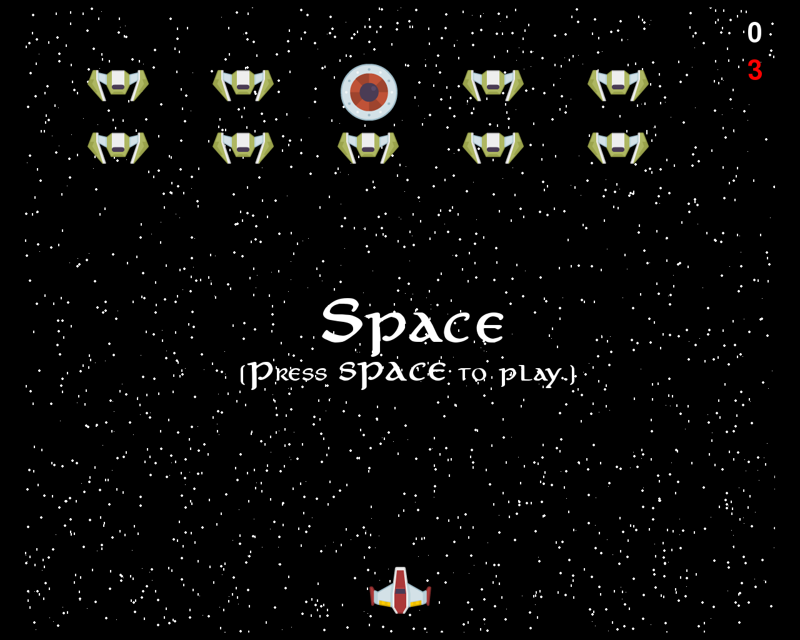
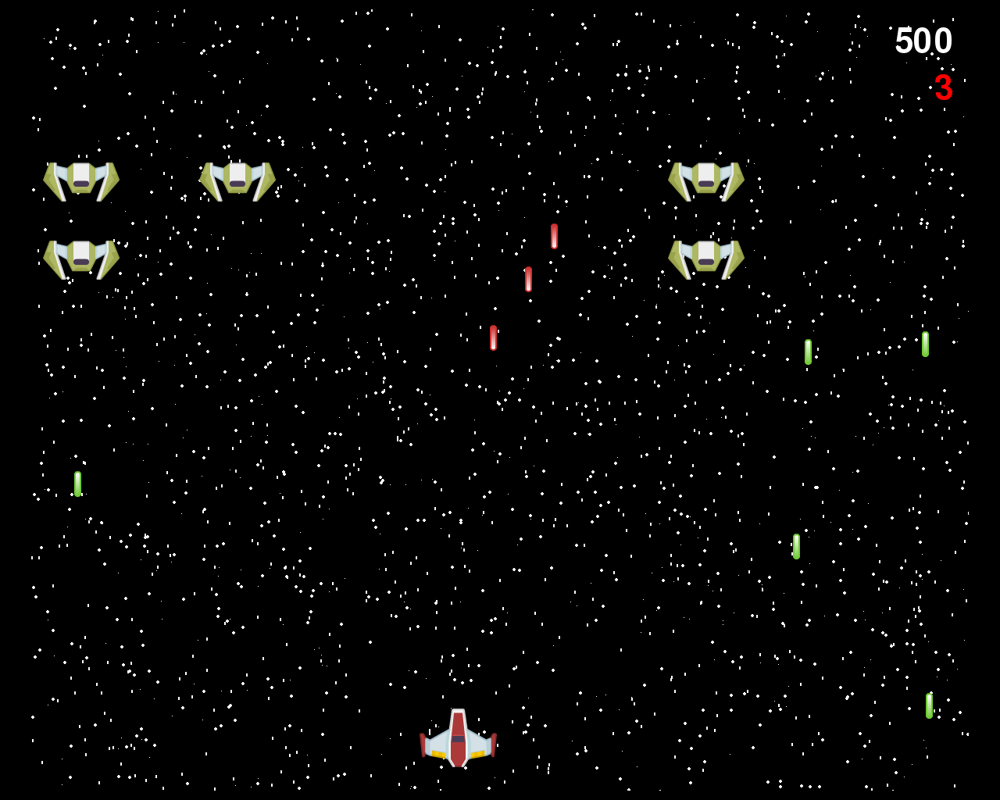

## Space

You can use the [editor on GitHub](https://github.com/ewalke0309/space-war1/edit/master/README.md) to maintain and preview the content for your website in Markdown files.

Whenever you commit to this repository, GitHub Pages will run [Jekyll](https://jekyllrb.com/) to rebuild the pages in your site, from the content in your Markdown files.

### Back
```markdown
Syntax highlighted code block

# Header 1
## Header 2
### Header 3

- Bulleted
- List

1. Numbered
2. List

**Bold** and _Italic_ and `Code` text

[Link](url) and 
```
### Backstory
- You must protect your solar system from the alien invaders
- Kill all of the invaders to win
-
### Instructions
- press "Space" to start
- press "Esc" to quit
- use the arrow keys to move up and down and left and right
- press "Space" while playing to shoot
- press "Space" once game ends to play again

### Scoring
- Every enemy that you kill gives you 100 points
-

